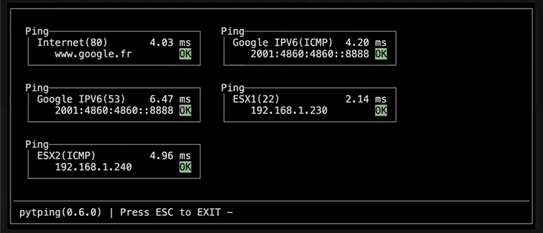

# pytping:
[]()




# Why:

The tool aims to simplify the process of checking multiple network nodes
using the ping command. Currently, checking multiple nodes requires opening
multiple terminals and switching between them, which can be time-consuming
and confusing, especially if one has to keep track of the IP addresses for
each node.

To resolve this issue, the tool is designed to provide a unified interface
that can be used quickly and efficiently in Linux environments. It utilizes
the "curses" library, which is provided by the system V/Posix environments.
This library allows for the creation of a graphical user interface that is
easy to use and understand.

In summary, the tool provides a simple and efficient solution to the
challenges faced when checking multiple network nodes using the ping
command, making the task less time-consuming and more manageable.

__This project is not :__

- :x: a ping command replacement
- :x: a tool (MultiPing/PingInfoView) replacement
- :x: a network analyzer
- :x: a CMDB tool

# Setup:

We use Ubuntu to develop this package and python is a core component of the
operating system. Our makefile, has been written according to this
environment.
In other environment, user should use "pip3" command to install this
package.
If you use virtualenv, then you will not use sudo to launch the setup.

- Download the package:
  ```shell
  $ git clone https://github.com/francois-le-ko4la/python-ping.git
  ```

- Change to the folder:
  ```shell
  $ cd python-ping
  ```

- Install :
  ```shell
  $ make install
  ```

# Test:
```shell
make test.py
```

# Use:

- Check network permissions to ping

  ```shell
  $ sudo iptables -P OUTPUT ACCEPT
  ```

- Use the script provided in this package :

  ```shell
  $ pytping -h
  usage: pytping [-h] [-v] -i INPUT
  Ping tool...
  optional arguments:
    -h, --help            show this help message and exit
    -v, --version         show program's version number and exit
  required arguments:
    -i INPUT, --input INPUT
                          Input file name
  ```

    Configuration file should be written according to this example:

    ```yaml
    ---
    nodes:
      Internet:
        host: www.google.fr
        port: 80
      vCenter:
        host: 192.168.1.12
        port: ICMP
      ESX1:
        host: 192.168.1.230
        port: 22
      ESX2:
        host: 192.168.1.240
        port: ICMP
    ...
    ```

# License

This package is distributed under the [GPLv3 license](./LICENSE)
