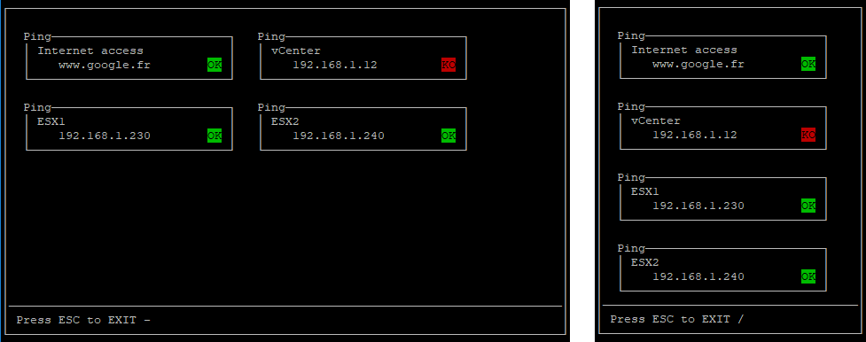
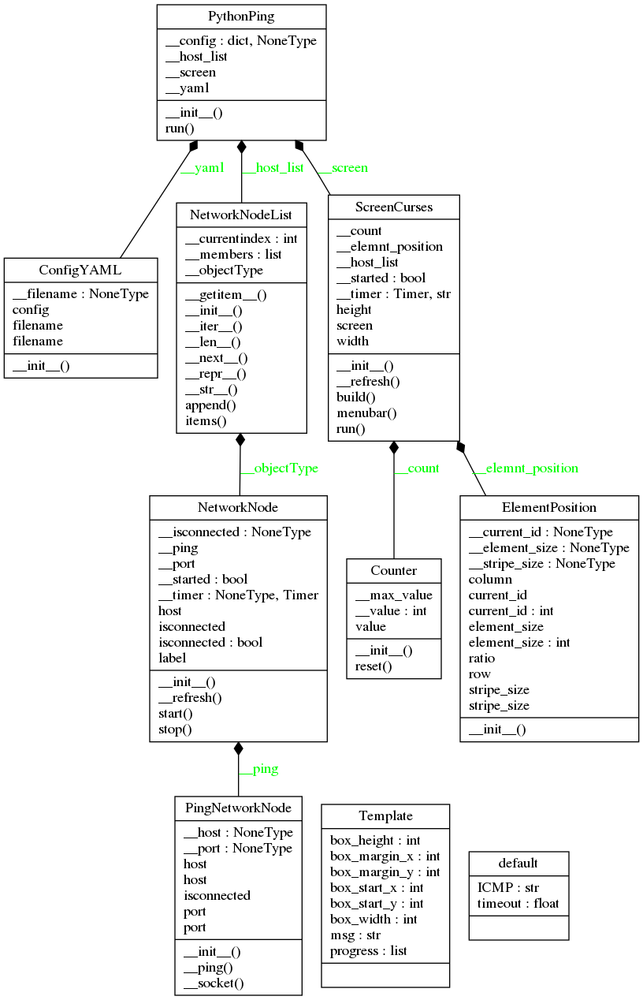

# pytping



## Why:

When you have to check a network node, you use ping command and all is fine.
Sometimes, you have to manage multiple nodes. As a consequence, you have to
open multiple terminal windows to ping the nodes. In the real life, this kind
of tasks are not really interresting and you have to switch between the
windows. Of course, at the same time, you have to remember IP address.

Basically, you have many ping tools on Windows.
My objective is to provide a __simple/light tool__ that can be used quickly
on linux environments.

The GUI has been build with `curses` library provided by system V/posix
environments. A windows library exists and allow you to adapt the screen
module.

__This project is not :__
- a ping command replacement
- a tool (MultiPing/PingInfoView) replacement
- a network analyzer
- a CMDB tool

## Setup:

```shell
$ git clone https://github.com/francois-le-ko4la/pyt-ping.git
$ cd pyt-ping
$ make install
```

## Test:

This module has been [tested and validated](./last_check.log) on Ubuntu.
```shell
$ make test
```

## Use:

Use the script provided in this package :
```shell
$ pyt-ping.py -h
usage: pyt-ping.py [-h] [-v] -i INPUT

Ping tool...

optional arguments:
  -h, --help            show this help message and exit
  -v, --version         show program's version number and exit

required arguments:
  -i INPUT, --input INPUT
                        Input file name

Enjoy...
```

Configuration file should be written according to this example:
```yaml
Internet access:
  host: www.google.fr
  port: 80
vCenter:
  host: 192.168.1.12
  port: ICMP
ESX1:
  host: 192.168.1.230
  port: 23
ESX2:
  host: 192.168.1.240
  port: ICMP
```

## Project Structure
```
.
├── bin
│   ├── config.yml.sample
│   └── pyt-ping.py
├── last_check.log
├── LICENSE
├── Makefile
├── MANIFEST.in
├── pictures
│   ├── classes_pytping.png
│   ├── packages_pytping.png
│   └── screen.png
├── pytping
│   ├── _ _about_ _.py
│   ├── confyaml.py
│   ├── counter.py
│   ├── _ _init_ _.py
│   ├── main.py
│   ├── netnode.py
│   ├── nodelist.py
│   ├── ping.py
│   ├── position.py
│   ├── pyping.py
│   └── screen.py
├── README.md
├── requirements.txt
├── runtime.txt
├── setup.cfg
├── setup.py
└── tests
    ├── test_doctest.py
    └── test_pycodestyle.py
```

## Todo:

- [X] Create the project
- [X] Write code and tests
- [X] Test installation and requirements (setup.py and/or Makefile)
- [X] Test code
- [X] Validate features
- [X] Write Doc/stringdoc
- [X] Run PEP8 validation
- [X] Clean & last check
- [ ] Release

## License

pytping is distributed under the [GPLv3 license](./LICENSE)
## Dev notes
### Runtime

```
python-3.6.x

```
### Requirements

```
setuptools==39.0.1
pycodestyle==2.3.1
PyYAML==3.12

```
### UML Diagram


### Objects
[ConfigYAML()](#configyaml)<br />
[ConfigYAML.__getitem__(self, key)](#configyamlgetitemself-key)<br />
[ConfigYAML.__init__(self, filename)](#configyamlinitself-filename)<br />
[ConfigYAML.__iter__(self)](#configyamliterself)<br />
[ConfigYAML.__len__(self)](#configyamllenself)<br />
[ConfigYAML.__load(self)](#configyaml__loadself)<br />
[ConfigYAML.items(self)](#configyamlitemsself)<br />
[ConfigYAML.keys(self)](#configyamlkeysself)<br />
[Counter()](#counter)<br />
[@Property: Counter.value](#property-countervalue)<br />
[Counter.__init__(self, max_value)](#counterinitself-max_value)<br />
[Counter.reset(self)](#counterresetself)<br />
[ElementPosition()](#elementposition)<br />
[@Property: ElementPosition.column](#property-elementpositioncolumn)<br />
[@Property: ElementPosition.current_id](#property-elementpositioncurrent_id)<br />
[@Property: ElementPosition.element_size](#property-elementpositionelement_size)<br />
[@Property: ElementPosition.ratio](#property-elementpositionratio)<br />
[@Property: ElementPosition.row](#property-elementpositionrow)<br />
[@Property: ElementPosition.stripe_size](#property-elementpositionstripe_size)<br />
[ElementPosition.__init__(self)](#elementpositioninitself)<br />
[NetworkNode()](#networknode)<br />
[@Property: NetworkNode.isconnected](#property-networknodeisconnected)<br />
[NetworkNode.__init__(self, label, host, port)](#networknodeinitself-label-host-port)<br />
[NetworkNode.__refresh(self)](#networknode__refreshself)<br />
[NetworkNode.start(self)](#networknodestartself)<br />
[NetworkNode.stop(self)](#networknodestopself)<br />
[NetworkNodeList()](#networknodelist)<br />
[NetworkNodeList.__init__(self)](#networknodelistinitself)<br />
[NetworkNodeList.__iter__(self)](#networknodelistiterself)<br />
[NetworkNodeList.__len__(self)](#networknodelistlenself)<br />
[NetworkNodeList.__next__(self)](#networknodelistnextself)<br />
[NetworkNodeList.append(self, value)](#networknodelistappendself-value)<br />
[NetworkNodeList.items(self)](#networknodelistitemsself)<br />
[PingNetworkNode()](#pingnetworknode)<br />
[@Property: PingNetworkNode.host](#property-pingnetworknodehost)<br />
[@Property: PingNetworkNode.isconnected](#property-pingnetworknodeisconnected)<br />
[@Property: PingNetworkNode.port](#property-pingnetworknodeport)<br />
[PingNetworkNode.__init__(self, host, port)](#pingnetworknodeinitself-host-port)<br />
[PingNetworkNode.__ping(self)](#pingnetworknode__pingself)<br />
[PingNetworkNode.__socket(self)](#pingnetworknode__socketself)<br />
[PytFile()](#pytfile)<br />
[@Property: PytFile.filename](#property-pytfilefilename)<br />
[PytFile.__init__(self, filename)](#pytfileinitself-filename)<br />
[PytFile.__repr__(self)](#pytfilereprself)<br />
[PytFile.__str__(self)](#pytfilestrself)<br />
[PytFile.read(self)](#pytfilereadself)<br />
[PythonPing()](#pythonping)<br />
[PythonPing.__init__(self, inputfile)](#pythonpinginitself-inputfile)<br />
[PythonPing.run(self)](#pythonpingrunself)<br />
[ScreenCurses()](#screencurses)<br />
[ScreenCurses.__init__(self, host_list)](#screencursesinitself-host_list)<br />
[ScreenCurses.__refresh(self)](#screencurses__refreshself)<br />
[ScreenCurses.build(self)](#screencursesbuildself)<br />
[ScreenCurses.menubar(self)](#screencursesmenubarself)<br />
[ScreenCurses.run(self)](#screencursesrunself)<br />


#### ConfigYAML()
```python
class ConfigYAML(dict):
```

```
This class manage YAML config file

Args:
    - filename (str): /path/to/the/config/file

Use:
    >>> # pathlib to run the test everywhere
    >>> import pathlib
    >>> path = str(pathlib.Path(__file__).resolve().parent) + "/"
    >>> config = ConfigYAML(path + '../bin/config.yml.samp')
    Traceback (most recent call last):
    ...
    OSError: File not found !
    >>> config = ConfigYAML(path + '../LICENSE')
    Traceback (most recent call last):
    ...
    ValueError: Can't load the YAML...
    >>> config = ConfigYAML(path + '../bin/config.yml.sample')
    >>> print(config['Internet access'])
    {'host': 'www.google.fr', 'port': 80}
    >>> print(config.keys())
    dict_keys(['Internet access', 'vCenter', 'ESX1', 'ESX2'])
    >>> print(len(config))
    4
    >>> #import json
    >>> #print(json.dumps(config, indent=4))
```

##### ConfigYAML.__getitem__(self, key)
```python
def ConfigYAML.__getitem__(self, key):
```
> <br />
> x.__getitem__(y) <==> x[y]<br />
> <br />
##### ConfigYAML.__init__(self, filename)
```python
def ConfigYAML.__init__(self, filename):
```
> <br />
> Initialize self.  See help(type(self)) for accurate signature.<br />
> <br />
##### ConfigYAML.__iter__(self)
```python
def ConfigYAML.__iter__(self):
```
> <br />
> Implement iter(self).<br />
> <br />
##### ConfigYAML.__len__(self)
```python
def ConfigYAML.__len__(self):
```
> <br />
> Return len(self).<br />
> <br />
##### ConfigYAML.__load(self)
```python
def ConfigYAML.__load(self):
```
> <br />
> Docstring empty<br />
> <br />
##### ConfigYAML.items(self)
```python
def ConfigYAML.items(self):
```
> <br />
> D.items() -> a set-like object providing a view on D's items<br />
> <br />
##### ConfigYAML.keys(self)
```python
def ConfigYAML.keys(self):
```
> <br />
> D.keys() -> a set-like object providing a view on D's keys<br />
> <br />
#### Counter()
```python
class Counter(object):
```

```
This class count from 0 to max_value.
In the end, we restart the count.

+-----+    +-----+    +-----+           +-------+
|  0  | -> |  1  | -> |  2  | -> ... -> |  max  |
+-----+    +-----+    +-----+           +-------+
  ^                                         |
  |                                         |
  +-----------------------------------------+

Attributes:
    value (int): current value

Test:
    python3 -m doctest -v <module>

Use:
    >>> max_value = 2
    >>> a = Counter(max_value)
    >>> print(a.value)
    0
    >>> print(a.value)
    1
    >>> print(a.value)
    2
    >>> print(a.value)
    0
```

##### @Property: Counter.value
```python
@property
def Counter.value(self):

```
> <br />
> <b>@Property:</b><br />
> &nbsp;&nbsp;&nbsp;&nbsp;&nbsp;&nbsp;&nbsp;&nbsp;&nbsp;&nbsp;&nbsp;&nbsp;&nbsp;&nbsp;&nbsp;  current value (int)<br />
> <br />
##### Counter.__init__(self, max_value)
```python
def Counter.__init__(self, max_value):
```
> <br />
> Initialize self.  See help(type(self)) for accurate signature.<br />
> <br />
##### Counter.reset(self)
```python
def Counter.reset(self):
```
> <br />
> reset current value<br />
> <br />
> <b>Args:</b><br />
> &nbsp;&nbsp;&nbsp;&nbsp;&nbsp;&nbsp;&nbsp;&nbsp;&nbsp;&nbsp;&nbsp;&nbsp;&nbsp;&nbsp;&nbsp;  None<br />
> <br />
> <b>Returns:</b><br />
> &nbsp;&nbsp;&nbsp;&nbsp;&nbsp;&nbsp;&nbsp;&nbsp;&nbsp;&nbsp;&nbsp;&nbsp;&nbsp;&nbsp;&nbsp;  None<br />
> <br />
#### ElementPosition()
```python
class ElementPosition(object):
```

```
Calc element position according to element stripe size and
stripe size.

  +------------+
  | Element 0  |
  +------------+
  <------------>
   Element size
                     Stripe Size
  <-------------------------------------------->
  .                                            .
  .                  Stripe 0                  .
  +--------------------------------------------+
  | +-----------+ +-----------+                |
  | | Element 0 | | Element 1 | ...            |
  | +-----------+ +-----------+                |
  +--------------------------------------------+

                     Stripe 1
  +--------------------------------------------+
  | +-----------+ +-----------+                |
  | | Element 0 | | Element 1 | ...            |
  | +-----------+ +-----------+                |
  +--------------------------------------------+

Use:
   >>> a = ElementPosition()
   >>> a.element_size = 3
   >>> a.stripe_size = 11
   >>> a.current_id = 0
   >>> print(a.row)
   0
   >>> print(a.column)
   0
   >>> a.current_id = 2
   >>> print(a.row)
   0
   >>> print(a.column)
   2
   >>> a.current_id = 3
   >>> print(a.row)
   1
   >>> print(a.column)
   0
```

##### @Property: ElementPosition.column
```python
@property
def ElementPosition.column(self):

```
> <br />
> <b>@Property:</b><br />
> &nbsp;&nbsp;&nbsp;&nbsp;&nbsp;&nbsp;&nbsp;&nbsp;&nbsp;&nbsp;&nbsp;&nbsp;&nbsp;&nbsp;&nbsp;  int: column<br />
> <br />
##### @Property: ElementPosition.current_id
```python
@property
def ElementPosition.current_id(self):
@current_id.setter
def ElementPosition.current_id(self, value):

```
> <br />
> <b>@Property:</b><br />
> &nbsp;&nbsp;&nbsp;&nbsp;&nbsp;&nbsp;&nbsp;&nbsp;&nbsp;&nbsp;&nbsp;&nbsp;&nbsp;&nbsp;&nbsp;  int: current element id<br />
> <br />
##### @Property: ElementPosition.element_size
```python
@property
def ElementPosition.element_size(self):
@element_size.setter
def ElementPosition.element_size(self, value):

```
> <br />
> <b>@Property:</b><br />
> &nbsp;&nbsp;&nbsp;&nbsp;&nbsp;&nbsp;&nbsp;&nbsp;&nbsp;&nbsp;&nbsp;&nbsp;&nbsp;&nbsp;&nbsp;  int: element size<br />
> <br />
##### @Property: ElementPosition.ratio
```python
@property
def ElementPosition.ratio(self):

```
> <br />
> <b>@Property:</b><br />
> &nbsp;&nbsp;&nbsp;&nbsp;&nbsp;&nbsp;&nbsp;&nbsp;&nbsp;&nbsp;&nbsp;&nbsp;&nbsp;&nbsp;&nbsp;  int: number of element per stripe<br />
> <br />
##### @Property: ElementPosition.row
```python
@property
def ElementPosition.row(self):

```
> <br />
> <b>@Property:</b><br />
> &nbsp;&nbsp;&nbsp;&nbsp;&nbsp;&nbsp;&nbsp;&nbsp;&nbsp;&nbsp;&nbsp;&nbsp;&nbsp;&nbsp;&nbsp;  int: row<br />
> <br />
##### @Property: ElementPosition.stripe_size
```python
@property
def ElementPosition.stripe_size(self):
@stripe_size.setter
def ElementPosition.stripe_size(self, value):

```
> <br />
> <b>@Property:</b><br />
> &nbsp;&nbsp;&nbsp;&nbsp;&nbsp;&nbsp;&nbsp;&nbsp;&nbsp;&nbsp;&nbsp;&nbsp;&nbsp;&nbsp;&nbsp;  int: stripe size<br />
> <br />
##### ElementPosition.__init__(self)
```python
def ElementPosition.__init__(self):
```
> <br />
> Initialize self.  See help(type(self)) for accurate signature.<br />
> <br />
#### NetworkNode()
```python
class NetworkNode(object):
```

```
Define a network node :
- label
- host
- port
```

##### @Property: NetworkNode.isconnected
```python
@property
def NetworkNode.isconnected(self):

```
> <br />
> <b>@Property:</b><br />
> &nbsp;&nbsp;&nbsp;&nbsp;&nbsp;&nbsp;&nbsp;&nbsp;&nbsp;&nbsp;&nbsp;&nbsp;&nbsp;&nbsp;&nbsp;  bool: True if the node is connected. False otherwise.<br />
> <br />
##### NetworkNode.__init__(self, label, host, port)
```python
def NetworkNode.__init__(self, label, host, port):
```
> <br />
> Initialize self.  See help(type(self)) for accurate signature.<br />
> <br />
##### NetworkNode.__refresh(self)
```python
def NetworkNode.__refresh(self):
```
> <br />
> Docstring empty<br />
> <br />
##### NetworkNode.start(self)
```python
def NetworkNode.start(self):
```
> <br />
> Start multithreading to ping the node.<br />
> <br />
> <b>Args:</b><br />
> &nbsp;&nbsp;&nbsp;&nbsp;&nbsp;&nbsp;&nbsp;&nbsp;&nbsp;&nbsp;&nbsp;&nbsp;&nbsp;&nbsp;&nbsp;  None<br />
> <br />
> <b>Returns:</b><br />
> &nbsp;&nbsp;&nbsp;&nbsp;&nbsp;&nbsp;&nbsp;&nbsp;&nbsp;&nbsp;&nbsp;&nbsp;&nbsp;&nbsp;&nbsp;  None<br />
> <br />
##### NetworkNode.stop(self)
```python
def NetworkNode.stop(self):
```
> <br />
> Stop multithreading<br />
> <br />
> <b>Args:</b><br />
> &nbsp;&nbsp;&nbsp;&nbsp;&nbsp;&nbsp;&nbsp;&nbsp;&nbsp;&nbsp;&nbsp;&nbsp;&nbsp;&nbsp;&nbsp;  None<br />
> <br />
> <b>Returns:</b><br />
> &nbsp;&nbsp;&nbsp;&nbsp;&nbsp;&nbsp;&nbsp;&nbsp;&nbsp;&nbsp;&nbsp;&nbsp;&nbsp;&nbsp;&nbsp;  None<br />
> <br />
#### NetworkNodeList()
```python
class NetworkNodeList(dict):
```

```
{} to store a python object's members (NetworkNode).
We want to test object type before store.
We use a dict() in order to make a complex object :

   +-------------------------------------+ --*
   |  label                              |   |
   | +------+    +------------+          |   |- __str__
   | | type | => |  obj type  |     obj  |   |  __iter__
   | +------+    +------------+          |   |  ...
   |                                     |   |
   | +------+    +------------+  *       |   |     --*
   | | data | => |  Object 0  |  |       |   |       |
   | +------+    +------------+  |       |   |       |
   |             +------------+  |       |   |       |
   |             |  Object 1  |  |- list |   |       |- append
   |             +------------+  |       |   |       |  items
   |                  ...        |       |   |       |  __len__
   |             +------------+  |       |   |       |  __next__
   |             |  Object n  |  |       |   |       |
   |             +------------+  *       |   |     --*
   +-------------------------------------+ --*

Obj type is protected by design and is NetworkNode type.
A new element type is compare with Obj type.
Another type will create a raise exception.

str(NetworkNodeList()) => str(ALL)
len(NetworkNodeList()) => len(list())
NetworkNodeList.append => list().append

    >>> a = NetworkNodeList()
    >>> b = NetworkNode("", "", "")
    >>> c = NetworkNode("", "", "")
    >>> a.append(b)
    >>> print(len(a))
    1
    >>> for member in a: print(type(member))
    <class 'pytping.netnode.NetworkNode'>
    >>> a.append(c)
    >>> print(len(a))
    2
    >>> for member in a: print(type(member))
    <class 'pytping.netnode.NetworkNode'>
    <class 'pytping.netnode.NetworkNode'>
    >>> a.append(3)
    Traceback (most recent call last):
    ...
    TypeError: This object is not a NetworkNode
```

##### NetworkNodeList.__init__(self)
```python
def NetworkNodeList.__init__(self):
```
> <br />
> Initialize self.  See help(type(self)) for accurate signature.<br />
> <br />
##### NetworkNodeList.__iter__(self)
```python
def NetworkNodeList.__iter__(self):
```
> <br />
> Implement iter(self).<br />
> <br />
##### NetworkNodeList.__len__(self)
```python
def NetworkNodeList.__len__(self):
```
> <br />
> Return len(self).<br />
> <br />
##### NetworkNodeList.__next__(self)
```python
def NetworkNodeList.__next__(self):
```
> <br />
> Docstring empty<br />
> <br />
##### NetworkNodeList.append(self, value)
```python
def NetworkNodeList.append(self, value):
```
> <br />
> add a member<br />
> <br />
##### NetworkNodeList.items(self)
```python
def NetworkNodeList.items(self):
```
> <br />
> get members<br />
> <br />
#### PingNetworkNode()
```python
class PingNetworkNode(object):
```

```
This class ping a network node.
We store host/port
Host can be defined with a hostname or IP address.
If port = ICMP then we use ping command.
Else, we use socket API.

    >>> a = PingNetworkNode("www.google.fr", 80)
    >>> print(a.isconnected)
    True
    >>> a = PingNetworkNode("localhost", "ICMP")
    >>> print(a.isconnected)
    True
    >>> a = PingNetworkNode("10.10.9.1", "ICMP")
    >>> print(a.isconnected)
    False
```

##### @Property: PingNetworkNode.host
```python
@property
def PingNetworkNode.host(self):
@host.setter
def PingNetworkNode.host(self, host):

```
> <br />
> <b>@Property:</b><br />
> &nbsp;&nbsp;&nbsp;&nbsp;&nbsp;&nbsp;&nbsp;&nbsp;&nbsp;&nbsp;&nbsp;&nbsp;&nbsp;&nbsp;&nbsp;  str: hostname or IP address<br />
> <br />
##### @Property: PingNetworkNode.isconnected
```python
@property
def PingNetworkNode.isconnected(self):

```
> <br />
> <b>@Property:</b><br />
> &nbsp;&nbsp;&nbsp;&nbsp;&nbsp;&nbsp;&nbsp;&nbsp;&nbsp;&nbsp;&nbsp;&nbsp;&nbsp;&nbsp;&nbsp;  bool: True if the node is connected. False otherwise.<br />
> <br />
##### @Property: PingNetworkNode.port
```python
@property
def PingNetworkNode.port(self):
@port.setter
def PingNetworkNode.port(self, port):

```
> <br />
> <b>@Property:</b><br />
> &nbsp;&nbsp;&nbsp;&nbsp;&nbsp;&nbsp;&nbsp;&nbsp;&nbsp;&nbsp;&nbsp;&nbsp;&nbsp;&nbsp;&nbsp;  str/int: "ICMP" or port number<br />
> <br />
##### PingNetworkNode.__init__(self, host, port)
```python
def PingNetworkNode.__init__(self, host, port):
```
> <br />
> Initialize self.  See help(type(self)) for accurate signature.<br />
> <br />
##### PingNetworkNode.__ping(self)
```python
def PingNetworkNode.__ping(self):
```
> <br />
> Docstring empty<br />
> <br />
##### PingNetworkNode.__socket(self)
```python
def PingNetworkNode.__socket(self):
```
> <br />
> Docstring empty<br />
> <br />
#### PytFile()
```python
class PytFile(object):
```

```
>>> fstab = PytFile("/etc/fstab")
>>> print(fstab.filename.stem)
fstab
>>> print(fstab)
/etc/fstab
>>> license = PytFile("../LICENSE")
>>> print(license.filename.stem)
LICENSE
>>> #print(license.read())
```

##### @Property: PytFile.filename
```python
@property
def PytFile.filename(self):
@filename.setter
def PytFile.filename(self, value):

```
> <br />
> @Property<br />
> <br />
##### PytFile.__init__(self, filename)
```python
def PytFile.__init__(self, filename):
```
> <br />
> Initialize self.  See help(type(self)) for accurate signature.<br />
> <br />
##### PytFile.__repr__(self)
```python
def PytFile.__repr__(self):
```
> <br />
> Return repr(self).<br />
> <br />
##### PytFile.__str__(self)
```python
def PytFile.__str__(self):
```
> <br />
> Return str(self).<br />
> <br />
##### PytFile.read(self)
```python
def PytFile.read(self):
```
> <br />
> Docstring empty<br />
> <br />
#### PythonPing()
```python
class PythonPing(object):
```

```
Main class
Use YAML config file
Create NetworkNodeList
Launch the screen manager
```

##### PythonPing.__init__(self, inputfile)
```python
def PythonPing.__init__(self, inputfile):
```
> <br />
> self.__config = ConfigYAML(inputfile) <br />
> <br />
##### PythonPing.run(self)
```python
def PythonPing.run(self):
```
> <br />
> start screen<br />
> <br />
#### ScreenCurses()
```python
class ScreenCurses(object):
```

```
This class manage the screen.

+-----------------------------------------------------------------+
|                                                                 |
|     +-------------+  +-------------+  +-------------+           |
|     | NetworkNode |  | NetworkNode |  | NetworkNode |           |
|     +-------------+  +-------------+  +-------------+           |
|                                                                 |
|                                                                 |
|                                                                 |
|                                                                 |
|                                                                 |
|                                                                 |
|                                                                 |
|                                                                 |
|                                                                 |
|                                                                 |
|                                                                 |
+-----------------------------------------------------------------+
|  Press ESC to EXIT (*)                                          |
+-----------------------------------------------------------------+

+-------------+
| NetworkNode |    Network Node : label, IP, status
+-------------+

(*)                Progress
```

##### ScreenCurses.__init__(self, host_list)
```python
def ScreenCurses.__init__(self, host_list):
```
> <br />
> Initialize self.  See help(type(self)) for accurate signature.<br />
> <br />
##### ScreenCurses.__refresh(self)
```python
def ScreenCurses.__refresh(self):
```
> <br />
> Docstring empty<br />
> <br />
##### ScreenCurses.build(self)
```python
def ScreenCurses.build(self):
```
> <br />
> Build the screen<br />
> <br />
> <b>Args:</b><br />
> &nbsp;&nbsp;&nbsp;&nbsp;&nbsp;&nbsp;&nbsp;&nbsp;&nbsp;&nbsp;&nbsp;&nbsp;&nbsp;&nbsp;&nbsp;  None<br />
> <br />
> <b>Returns:</b><br />
> &nbsp;&nbsp;&nbsp;&nbsp;&nbsp;&nbsp;&nbsp;&nbsp;&nbsp;&nbsp;&nbsp;&nbsp;&nbsp;&nbsp;&nbsp;  None<br />
> <br />
##### ScreenCurses.menubar(self)
```python
def ScreenCurses.menubar(self):
```
> <br />
> draw the bar<br />
> <br />
> <b>Args:</b><br />
> &nbsp;&nbsp;&nbsp;&nbsp;&nbsp;&nbsp;&nbsp;&nbsp;&nbsp;&nbsp;&nbsp;&nbsp;&nbsp;&nbsp;&nbsp;  None<br />
> <br />
> <b>Returns:</b><br />
> &nbsp;&nbsp;&nbsp;&nbsp;&nbsp;&nbsp;&nbsp;&nbsp;&nbsp;&nbsp;&nbsp;&nbsp;&nbsp;&nbsp;&nbsp;  None<br />
> <br />
##### ScreenCurses.run(self)
```python
def ScreenCurses.run(self):
```
> <br />
> Curses getch loop<br />
> <br />
> <b>Args:</b><br />
> &nbsp;&nbsp;&nbsp;&nbsp;&nbsp;&nbsp;&nbsp;&nbsp;&nbsp;&nbsp;&nbsp;&nbsp;&nbsp;&nbsp;&nbsp;  None<br />
> <br />
> <b>Returns:</b><br />
> &nbsp;&nbsp;&nbsp;&nbsp;&nbsp;&nbsp;&nbsp;&nbsp;&nbsp;&nbsp;&nbsp;&nbsp;&nbsp;&nbsp;&nbsp;  None<br />
> <br />
